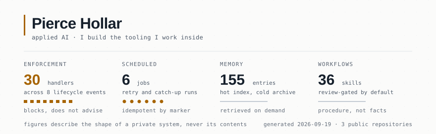

<picture>
  <source media="(prefers-color-scheme: dark)" srcset="assets/banner-dark.svg">
  
</picture>

I build applied-AI systems for small organizations, and the tooling I use to build them. Most of it starts from a problem someone actually has rather than from a demo.

## What I'm building

**[Caliber Integrations](https://caliberintegrations.com)** — done-with-you AI setup for small businesses. Find where the hours actually go, install systems around how the business already works, train the owner to run them.

**A personal AI operating layer** — the environment I work inside. One private, filesystem-backed context layer; several stateless clients reading and writing against it; an enforcement layer around the whole thing that blocks bad actions rather than advising against them.

Three ideas it runs on:

- **Retrieve on demand.** Context loads when a task needs it, not as a ritual bulk-read at the start of every session.
- **Facts and procedure are different things.** Memory records what is true. Workflows record how something is done. Mixing them makes both worse.
- **Verify consumption, not existence.** A file on disk is not evidence that anything loaded it or followed it. I learned that from a silent failure, and it is now a gate rather than a habit.

## Repositories

**[ai-operating-layer](https://github.com/piercehollar1-tech/ai-operating-layer)** — a sanitized reference architecture for the above: component boundaries, retrieval flow, and persistence model. Every included file uses placeholder data. The live system stays private.

**[claude-codex-image-gen](https://github.com/piercehollar1-tech/claude-codex-image-gen)** — a Claude Code skill that generates images through the Codex CLI's own `image_gen` tool, on an existing ChatGPT plan, with no API key. The plumbing is small; most of the repo is a prompt-craft rulebook, each rule earned from a render that came back wrong.

## Elsewhere

[LinkedIn](https://www.linkedin.com/in/pierce-hollar-111276361)

---

The banner regenerates nightly from a numbers-only manifest in this repo. It describes the shape of a private system, never its contents.
